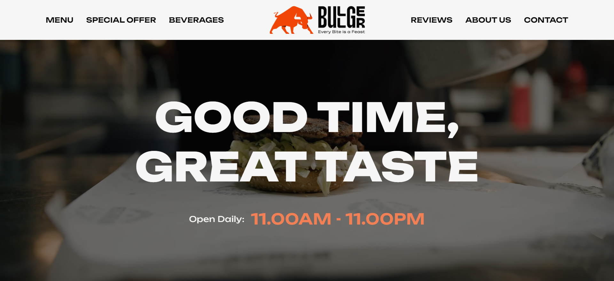
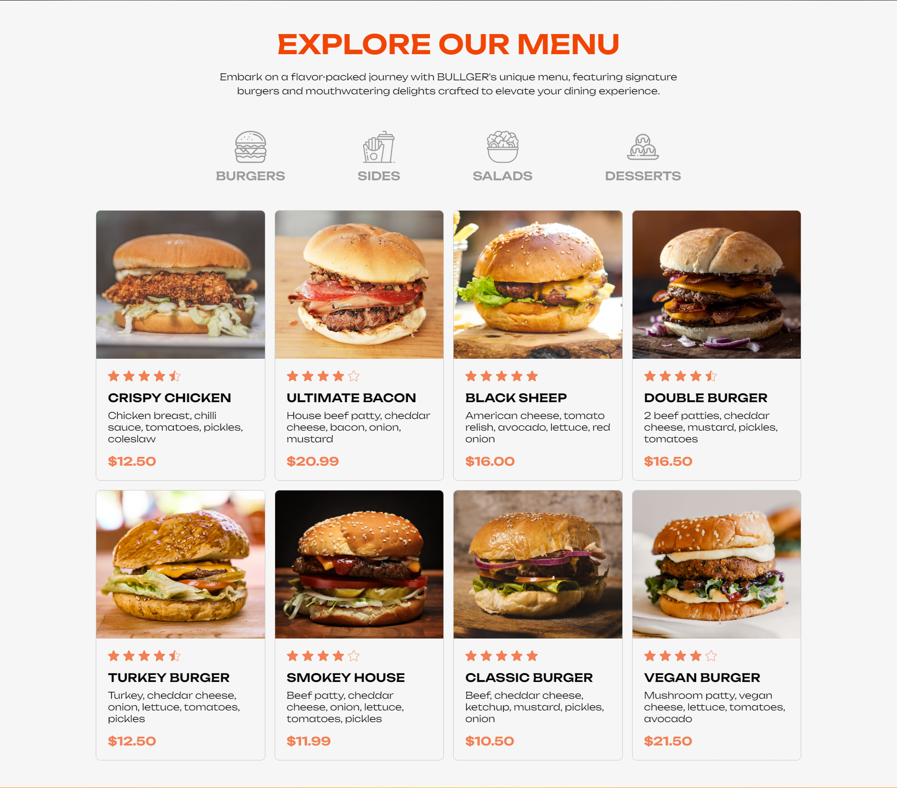
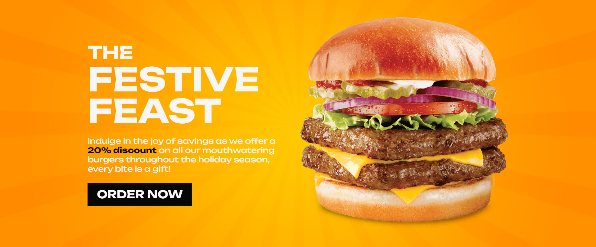
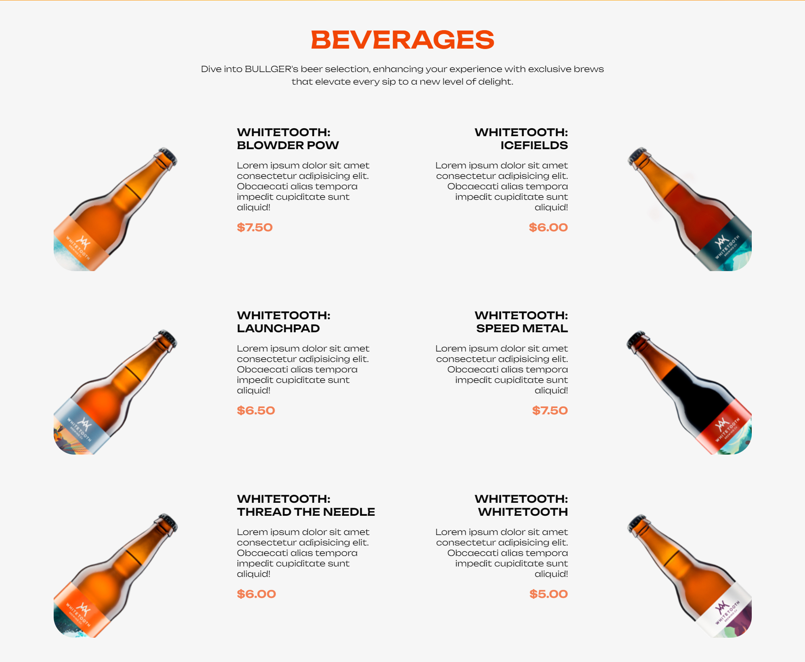
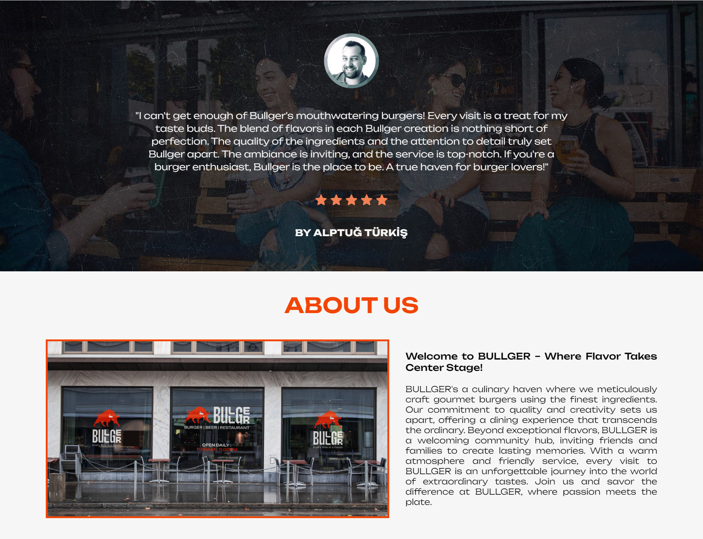
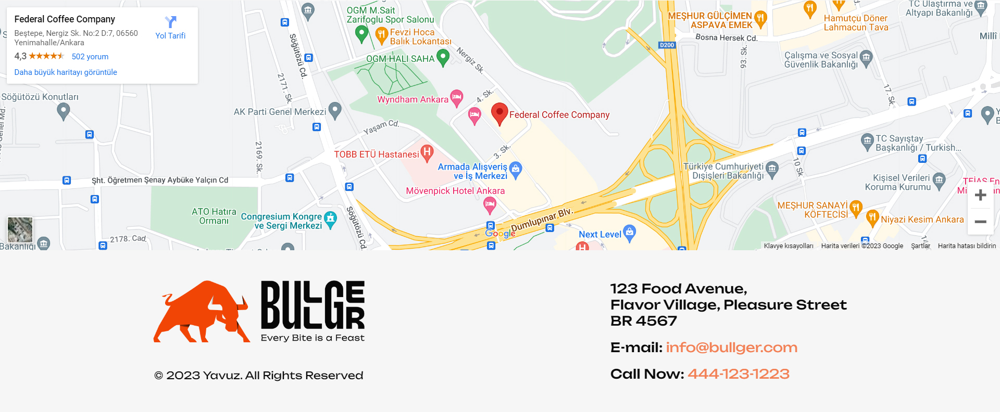

# 💯 Bullger Restaurant Website

Hi everyone! 👋

🚶‍♂️ I spent the past week completing the assignment given to me by my mentor Alptuğ Türkiş. I think it turned out a nice result and I wanted to show it to you. I managed to develop a website with all my own designs and coding, including the logo. I can say that this is my first website that is all mine.

## 🗿 Overview

### 📷 Screenshots

🙌 First of all, I want to tell you what I paid attention to in the design part by part, so the screenshots section may take a little longer. Thank you for your understanding.



⚡ I wanted the header and hero-section to appeal to the user's eye as much as possible, so I had to use something eye-catching. I thought of using a video and this is what I came up with.



⚡ When we came to the menu-section part, I wanted to make a menu design that would make the user we attracted crave for a hamburger and this result came out.



⚡ When we came to the special-offer section, I wanted to follow a method that would keep the user on the site more and I attached the deals section there. On the other hand, I wanted to prepare a visual feast for the users by putting an impressive hamburger image.



⚡ In the beverages section, I didn't want to make a standard drinks section. I added an animated design to make it stand out and attract attention. This was my mentor's favorite section.



⚡ In the reviews and about us section, since I want to make a single page website, I added it to be a bit long and to make it look exactly like a website.



⚡ In the footer part, I placed a google maps iframe in order to continue the one color one white design concept in my website. I wanted to make the footer as simple as possible. On the other hand, I wanted to use the `<address>`, `mailto:` and `tel:` tricks.

### 🔗 Links

- Live Site URL: [https://yavuzkarakus.github.io/bullgerRestaurantWebsite/](https://yavuzkarakus.github.io/bullgerRestaurantWebsite/)

## 🚀 My process

### ⚡ Built with

- Semantic HTML5 markup
- CSS custom properties
- Flexbox
- Grid
- My first project using JavaScript 👈

### 👾 What I learned

There is a little valuable information that I learned for the first time using JS. As rendering and synchronization are important structures in JS, we first use the `window.onload` property to create our objects on the DOM.

JS Code Snippet:

```js
window.onload = function () {
  let toTop = document.getElementById("to-top");

  window.onscroll = function () {
    scrollFunction();
  };

  function scrollFunction() {
    if (
      document.body.scrollTop > 650 ||
      document.documentElement.scrollTop > 650
    ) {
      toTop.style.visibility = "visible";
    } else {
      toTop.style.visibility = "hidden";
    }
  }
};
```

### 💪 Continued development

I've been trying to learn javascript lately, so I haven't been able to get anything right, but I want to learn javascript and make better projects, so keep working.

## 🚩 Author

- Yavuz Karakuş - [@yavuzkarakus](https://github.com/yavuzkarakus)

## 📒 Notes

🚶‍♂️ I plan to continue these challenges as long as I can. If you are interested in these topics, don't forget to tune in and follow me.

⭐ If you liked this project and the challenge, please don't forget to star it.

## 🙏🏼 Special Thanks

I would like to thank our mentor and teacher Alptuğ Türkiş, who answered our questions tirelessly.

- Alptuğ Türkiş - [@alptugturkis](https://github.com/carpediem23)
